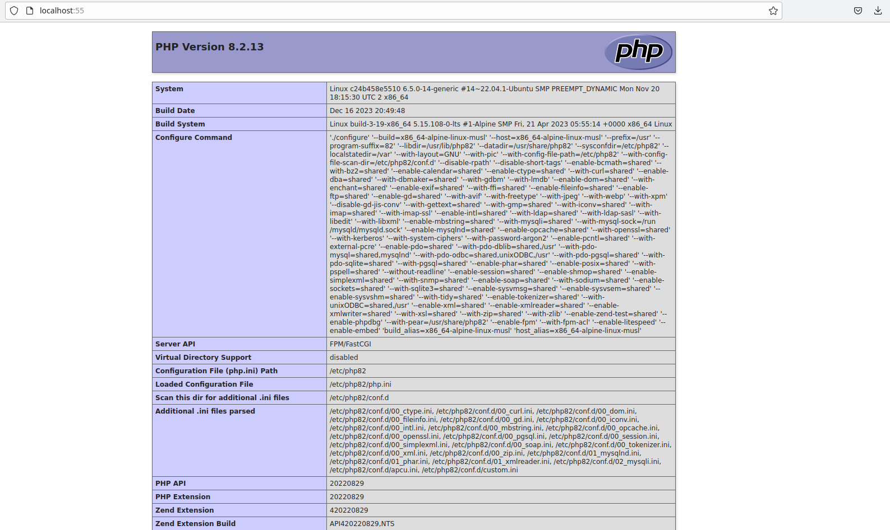

# Q1
Answer: 3 images

command: `sudo docker images`

# Q2
command: `sudo docker run alpine cat /etc/hostname`

# Q3
command: `sudo docker pull ubuntu:noble`

# Q4
command: `sudo docker run -d erseco/alpine-php-webserver`

# Q5
command: `sudo docker run -d -p 55:8080 erseco/alpine-php-webserver`

# Q6


# Q7
commands:
``` bash
sudo docker stop bold_edison

sudo docker rm bold_edison
```
*note: bold_edison is the random name docker gave to the container with no port binding*