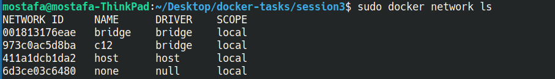

# Question 1
`sudo docker run -d --network host -v myVolume:/home/usr/volume1/ -v ~/Desktop/volume2:/home/usr/volume2 --memory=500m -e POSTGRES_PASSWORD=pass1234 --name db1 postgres`

# Question 2
```bash
    docker network create c12
    docker run -it --name c1 --network c12 alpine
    docker run -it --name c2 --network c12 alpine
    docker exec -it c1 /bin/sh
    # this ping should successfully ping c2 
    ping c2 

    docker run -it --name c3 alpine
    docker run -it --name c4 alpine
    docker exec -it c3 /bin/sh
    # this ping does not send a ping
    ping c4
    # this ping works just fine
    ping 172.17.0.3
```

# Question 3


# Question 4
- db1: 127.0.1.1
- c1: 172.18.0.3
- c2: 172.18.0.2
- c3: 172.17.0.2
- c4: 172.17.0.3